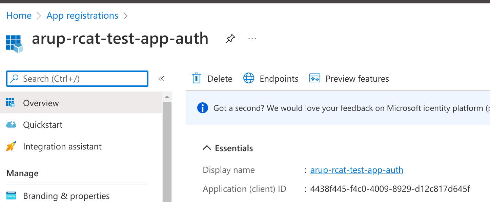
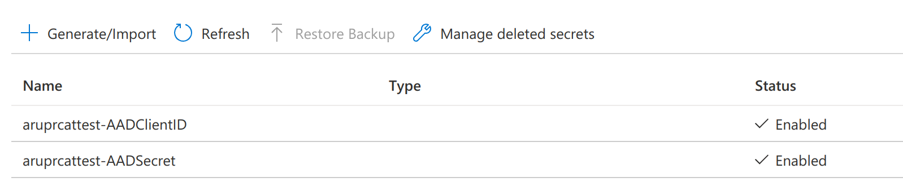
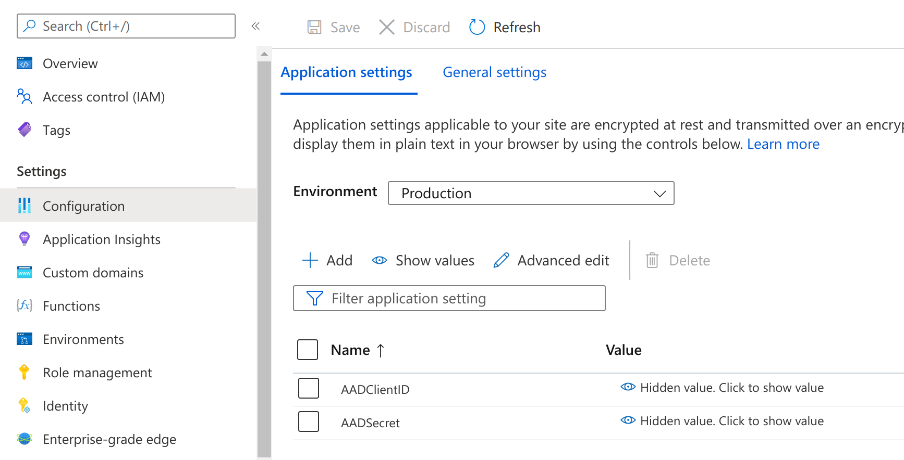
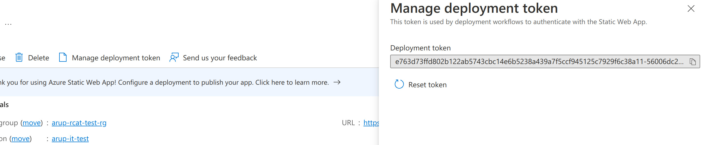
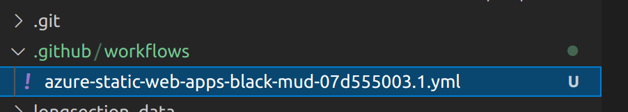
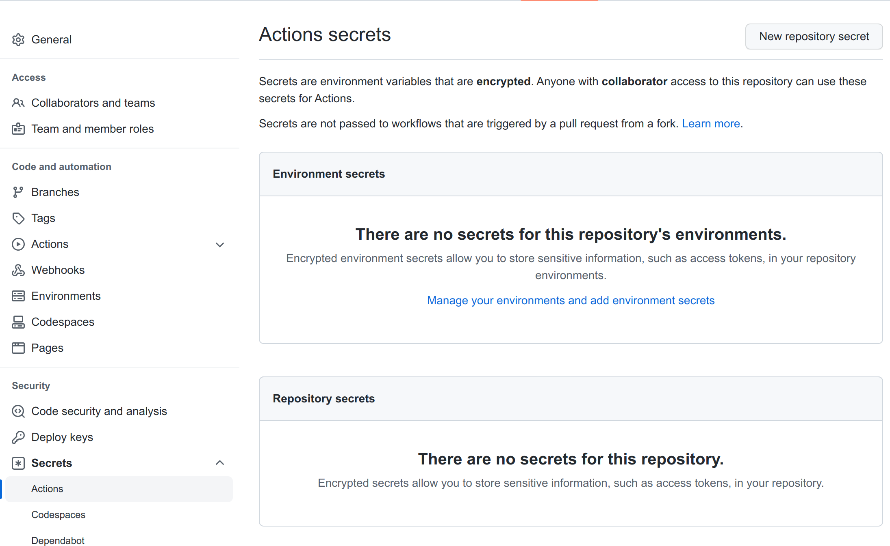
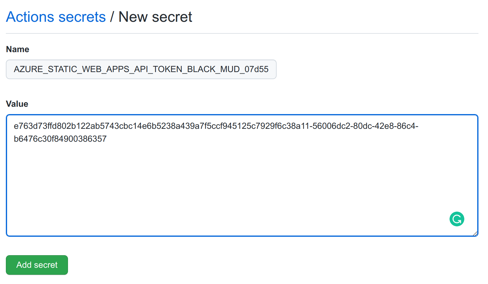
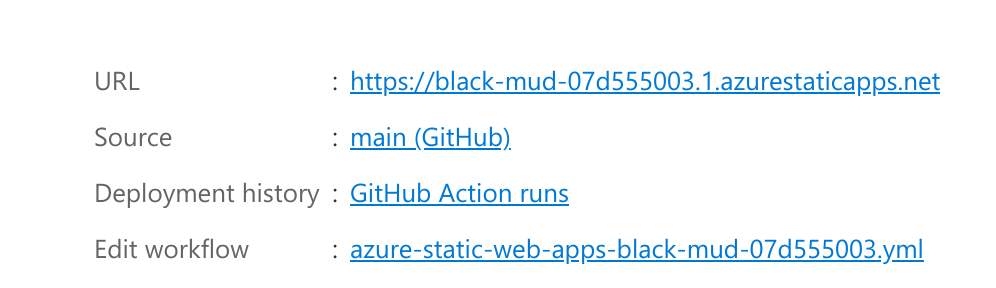

# Azure Static WebApp - EasyAuth 

## Overview  

- Application code will be hosted on Github.  
- The Azure Static app will be deployed with terraform
- Azure Static App will be linked to the GitHub repo
- GitHub Actions Configured to push updates to the static Site.
- EasyAuth (Azure App Registration) - will provide Authenitaion.


&nbsp;


Example Repo :   
https://github.com/kgptrainor/html-simple-site  


(Note : All secrets and referecnce to Static App URLs no longer exist - resources have been deleted)

## Terraform deployment  

Resources deployed :
- Azure recource group 
- Azure App Registration 
- Azure KeyVault to hold AppReg secrets
- Azure Static WebApp

Example repo : 
https://github.com/kgptrainor/terraform-azure-static-webapp

## Manual Configuration 

Terraform support for Azure static apps is stil quite limited. 

Reference :  
https://registry.terraform.io/providers/hashicorp/azurerm/latest/docs/resources/static_site

The terraform code creates the Azure AppReg and cilent secret but these need to be manually added to the Static WebApp Application settings.

&nbsp;

&nbsp;
&nbsp;

Retrive the Secrets from the keyvault  



Update the Static WebApp Application settings :


&nbsp;  


## Details needed for Github setup

The following details are needed for the GitHub configuration :  

- Deployment token
- URL name 

Retrive the the Deployment token from the Azure Static WebApp 

&nbsp;

&nbsp;

Azure Static App URL name  


Record these values 

Example :

Deployment token :  e763d73ffd802b122ab5743cbc14e6b5238a439a7f5ccf945125c7929f6c38a11-56006dc2-80dc-bla-bla 

URL : https://black-mud-07d555003.1.azurestaticapps.net  

&nbsp;  

# Link your Github repo to the Azure Static App  

Reference :  https://docs.microsoft.com/en-us/azure/static-web-apps/github-actions-workflow  

### Create your worlflow  

Within your code create a workflow file, ensure the name matches your site name.

Example : azure-static-web-apps-**black-mud-07d555003.1.yml**


&nbsp;

&nbsp;


Add the follwoing code : (Sample Code)

```
name: Azure Static Web Apps CI/CD

on: 
  push:
    branches:
      - main
  pull_request:
    types: [opened, synchronize, reopened, closed]
    branches:
      - main

jobs:
  build_and_deploy_job:
    if: github.event_name == 'push' || (github.event_name == 'pull_request' && github.event.action != 'closed')
    runs-on: ubuntu-latest
    name: Build and Deploy Job
    steps:
      - uses: actions/checkout@v2
        with:
          submodules: true
      - name: Build And Deploy
        id: builddeploy
        uses: Azure/static-web-apps-deploy@v1
        with:
          azure_static_web_apps_api_token: ${{ secrets.AZURE_STATIC_WEB_APPS_API_TOKEN_BLACK_MUD_07d555003  }}
          repo_token: ${{ secrets.GITHUB_TOKEN }} # Used for Github integrations (i.e. PR comments)
          action: "upload"
          ###### Repository/Build Configurations - These values can be configured to match your app requirements. ######
          # For more information regarding Static Web App workflow configurations, please visit: https://aka.ms/swaworkflowconfig
          app_location: "/" # App source code path
          api_location: "" # Api source code path - optional
          output_location: "" # Built app content directory - optional
          ###### End of Repository/Build Configurations ######

  close_pull_request_job:
    if: github.event_name == 'pull_request' && github.event.action == 'closed'
    runs-on: ubuntu-latest
    name: Close Pull Request Job
    steps:
      - name: Close Pull Request
        id: closepullrequest
        uses: Azure/static-web-apps-deploy@v1
        with:
          azure_static_web_apps_api_token: ${{ secrets.AZURE_STATIC_WEB_APPS_API_TOKEN_BLACK_MUD_07d555003  }}
          action: "close"

```


### Update api_token name within the workflow file
 
Update the api_token in your code to match your static app URL name :

reference URL : https://black-mud-07d555003.1.azurestaticapps.net  

Note : Github Sectets will reject the above naming convention you will have to drop the .1 at the end for the next step to work.

Use this value instead : **AZURE_STATIC_WEB_APPS_API_TOKEN_BLACK_MUD_07d555003** 


## Add Deployment token to Github Repo Secrets  


From Settings add > Secrets > Actions then new Repo Secret

&nbsp;



&nbsp;


When the GitHub action runs it will link your code to the Azure Static WebApp  

## Check the link to Github has worked  

When the above steps have run your Azure static web app should look like ths :  


&nbsp; 


## Add Authenicaton to your Application 

Create a file at the root of your github repo called staticwebapp.config.json

Add the follwoing code :

```
{
  "routes": [
       {
     "route": "/",
             "allowedRoles": [ "authenticated" ]
    }
 ],
 "responseOverrides": {
          "401": {
            "redirect": "/.auth/login/aad",
            "statusCode": 302
          }
        },
  "auth": {
    "identityProviders": {
      "azureActiveDirectory": {
        "registration": {
          "openIdIssuer": "https://login.microsoftonline.com/4ae48b41-0137-4599-8661-fc641fe77bea", 
          "clientIdSettingName": "AADClientID",
          "clientSecretSettingName": "AADSecret"
        },"userDetailsClaim": "http://schemas.xmlsoap.org/ws/2005/05/identity/claims/name"
              }
    }
  }
}
```
The Above code will reference the Azure StaticApp application settings and force authenication via the Azure EasyAuth. 


---

# Reference  

- Jeff Sanders Technical Blog  
https://jsandersrocksblog.github.io/2021/07/02/walkthrough-static-web-apps-and-aad-authentication.html
 
